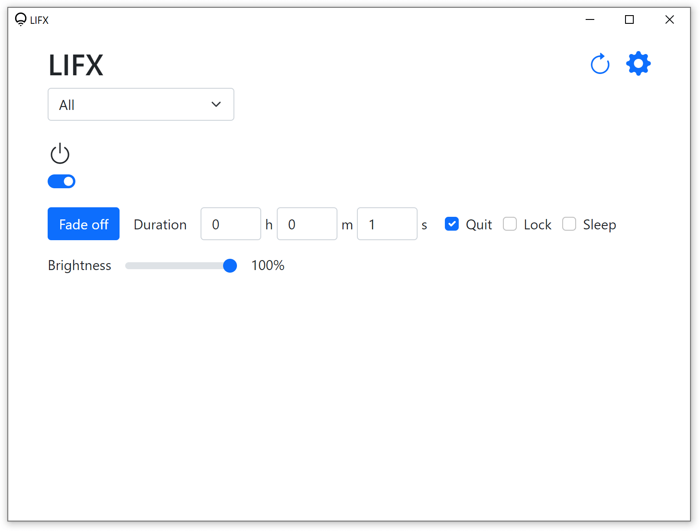
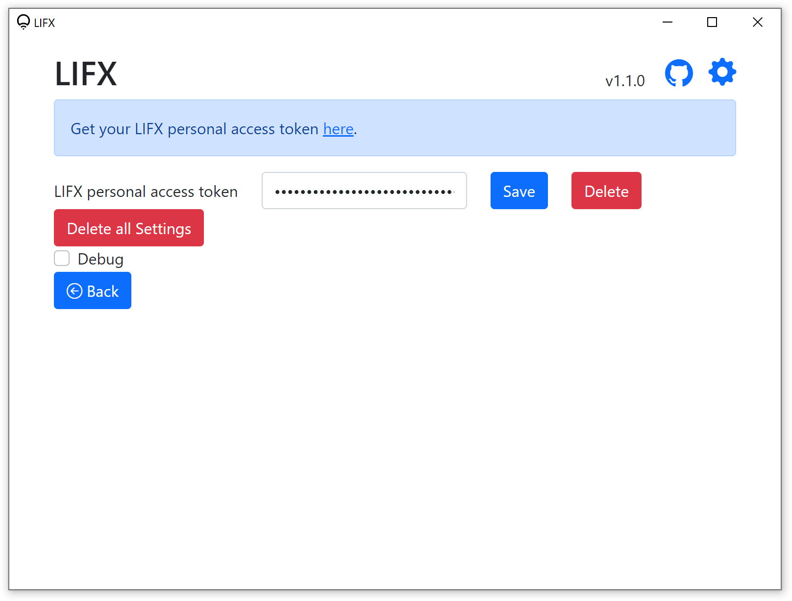

# LIFX App (unofficial)

A simple app to control LIFX lights over the Internet.

Available on multiple platforms:
- On the web as a Progressive Web App (PWA) that can be installed
- Desktop app (built using Electron)

Requires your LIFX personal access token, get it [here](https://cloud.lifx.com/).

No data is collected.\
Data is stored locally.\
The stored token and all settings can be deleted in the app Settings.

## Features
- Select light(s) to control: All, Location, Group, Light
- Turn on/off
- Fade on/off (can set the duration)
  - Only available in the desktop app: Quit and Lock (Windows only) after pressing the Fade button
- Set brightness

## Progressive Web App (PWA)
#### [LIFX Progressive Web App (unofficial)](https://adam777z.github.io/lifx/)

Can be installed (only available in [supported web browsers](https://caniuse.com/web-app-manifest)).

## Desktop app
### Screenshots (Windows 10)
\
Main

\
Settings

### Download
Download the latest version on the [Releases](https://github.com/Adam777Z/lifx/releases/latest) page.

### App data location
[See here](https://www.electronjs.org/docs/latest/api/app/#appgetpathname).

#### Portable mode (Windows only)
Supports storing the app data in the `data` folder next to the executable file.\
To enable, create the `data` folder where the executable file is located.\
The `data` folder already exists in the Portable version ZIP file.

### How to build
1. npm install
2. npm run dist

## Support and Feedback
Available under [Discussions](https://github.com/Adam777Z/lifx/discussions).

## Credits
- Thanks to [LIFX](https://www.lifx.com/) for the lights and the [LIFX HTTP API](https://api.developer.lifx.com/)
- [Electron](https://www.electronjs.org/) (desktop app)
- [Bootstrap](https://getbootstrap.com/)
- [Bootstrap Icons](https://icons.getbootstrap.com/)